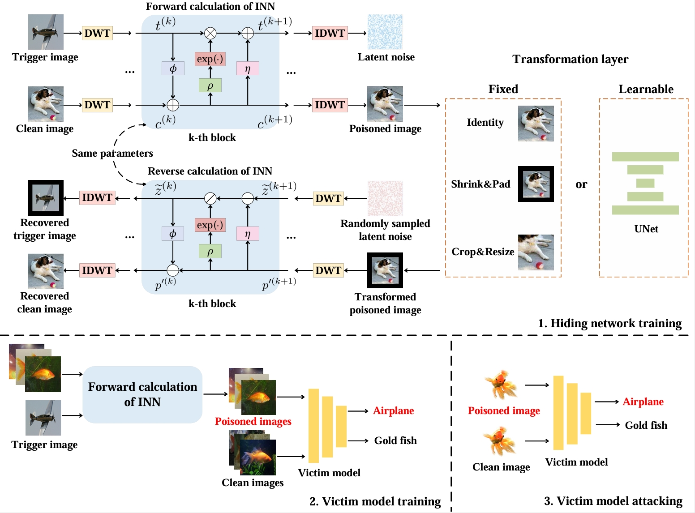

# SDriBA

This repo is implementation for the paper "A Trigger-Perceivable Backdoor Attack Framework Driven by Image Steganography".



​									Figure 1: The pipeline of the proposed SDriBA.

## How to run

### 1. Prepare the environment

```shell
conda create -n SDriBA python
conda activate SDriBA
conda install pytorch torchvision torchaudio pytorch-cuda=11.8 -c pytorch -c nvidia
conda install tensorboardX
conda install natsort
conda install scipy
conda install matplotlib
conda install progress
conda install scikit-image
pip install opencv-python
```

### 2. Train the SDriBA_FTL hiding network

You can set your training parameters in config.py before training the SDriBA_FTL hiding network .

```shell
cd ./SDriBA_FTL
python train.py
```

### 3. Train the SDriBA_LTL hiding network

You can set your training parameters in config.py before training the SDriBA_LTL hiding network .

```shell
cd ./SDriBA_LTL
python train.py
```

### 4. Create the poisoned dataset

Create the poisoned datasets of SDriBA_FTL.

```shell
cd ./SDriBA_FTL
python create_poison_dataset_cifar10.py
python create_poison_dataset_imagenet.py
python create_poison_dataset_gtsrb.py
```

Create the poisoned datasets of SDriBA_LTL.

```shell
cd ./SDriBA_LTL
python create_poison_dataset_cifar10.py
python create_poison_dataset_imagenet.py
```

### 5. Train the victim model

Train  vgg19_bn victim model of SDriBA_FTL on CIFAR-10 in 10% poisoning rate  for example.

```shell
cd ./Victim_model
python my_clean_model_cifar10.py -a vgg19_bn -c chk/SDriBA_FTL/cifar10 -r 10per
```

Test the CDA and ASR of SDriBA_FTL on CIFAR-10  for example.

```shell
python test_cifar10.py --resume ./chk/SDriBA_FTL/cifar10/airplane/10per-vgg19_bn-2024-09-19-16_27_24/checkpoint.pth.tar --wm_tst ./dataset/infect_cifar10/SDriBA_FTL/airplane/bdval -a vgg19_bn --gpu-id 1 --target airplane
```